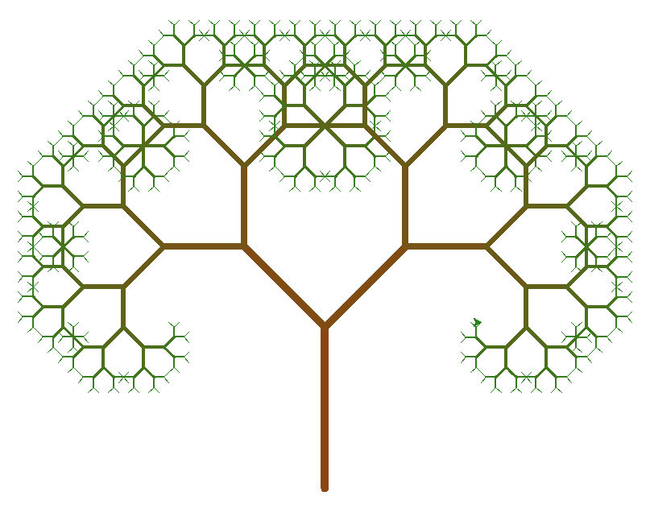
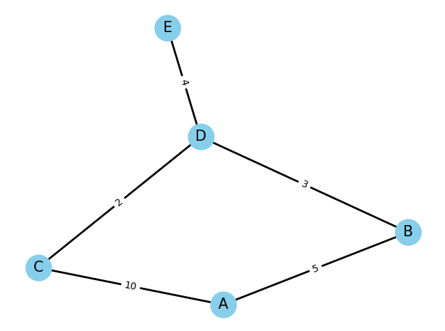
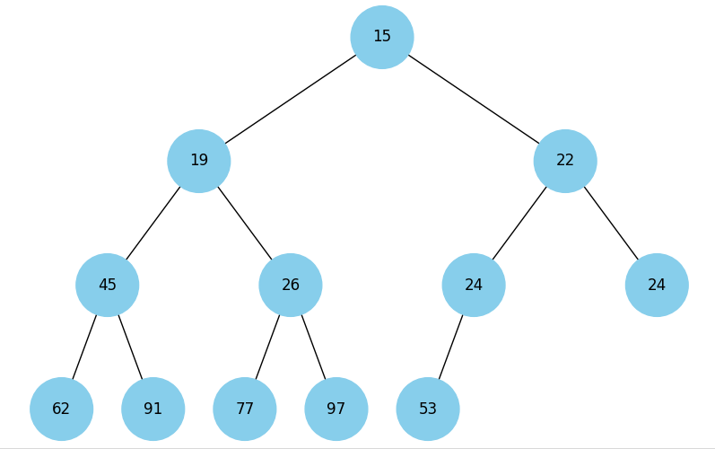
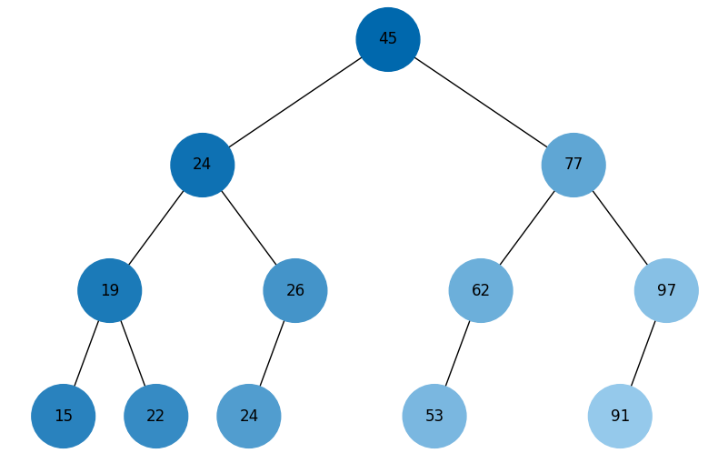
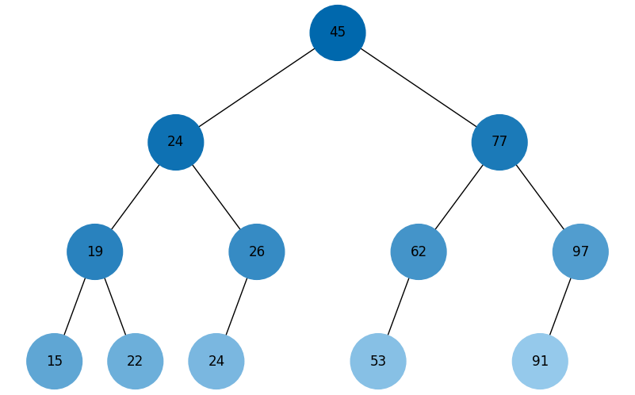

# Neoversity. Algorithms. Final project

goit-algo-fp

## Завдання 1. Структури даних. Сортування. Робота з однозв'язним списком

Для реалізації однозв'язного списку LinkedList необхідно:

- написати функцію, яка реалізує реверсування однозв'язного списку, змінюючи посилання між вузлами;
- розробити алгоритм сортування для однозв'язного списку, наприклад, сортування вставками або злиттям;
- написати функцію, що об'єднує два відсортовані однозв'язні списки в один відсортований список.

### Реалізація в файлі [task_1.py](src/task_1.py), тести в файлі [test_task_1.py](tests/test_task_1.py):

- **LinkedList.reverse()** - реверс списку.
- **LinkedList.sort(reverse=False)** - сортування списку злиттям.
- **LinkedList._sorted_merge()** - об'єднання відсортованих списків (використовується в сортуванні).

## Завдання 2. Рекурсія. Створення фрактала “дерево Піфагора” за допомогою рекурсії

Необхідно написати програму на Python, яка використовує рекурсію для створення фрактала “дерево Піфагора”. Програма має візуалізувати фрактал “дерево Піфагора”, і користувач повинен мати можливість вказати рівень рекурсії.

### Реалізація в файлі [task_2.py](src/task_2.py)



## Завдання 3. Дерева, алгоритм Дейкстри

Розробіть алгоритм Дейкстри для знаходження найкоротших шляхів у зваженому графі, використовуючи бінарну купу. Завдання включає створення графа, використання піраміди для оптимізації вибору вершин та обчислення найкоротших шляхів від початкової вершини до всіх інших.

### Реалізація в файлі [task_3.py](src/task_3.py), тести в файлі [test_task_3.py](tests/test_task_3.py)

``` bash
Shortest paths from node A:
 {'A': 0, 'B': 5, 'C': 10, 'D': 8, 'E': 12}
========================================
Networkx: Shortest paths from node A:
 {'A': 0, 'B': 5, 'D': 8, 'C': 10, 'E': 12}
```

Візуалізація графа



## Завдання 4. Візуалізація піраміди

Використовуючи як базу цей код, побудуйте функцію, що буде візуалізувати бінарну купу.

👉🏻 Примітка. Суть завдання полягає у створенні дерева із купи.

### Реалізація в файлі [task_4.py](src/task_4.py)

Візуалізація купи



## Завдання 5. Візуалізація обходу бінарного дерева

Використовуючи код із завдання 4 для побудови бінарного дерева, необхідно створити програму на Python, яка візуалізує обходи дерева: у глибину та в ширину.

Вона повинна відображати кожен крок у вузлах з різними кольорами, використовуючи 16-систему RGB (приклад #1296F0). Кольори вузлів мають змінюватися від темних до світлих відтінків, залежно від послідовності обходу. Кожен вузол при його відвідуванні має отримувати унікальний колір, який візуально відображає порядок обходу.

> 👉🏻 Примітка. Використовуйте стек та чергу, НЕ рекурсію

### Реалізація в файлі [task_5.py](src/task_5.py)

Візуалізація DFS Preorder



Візуалізація BFS Preorder



## Завдання 6. Жадібні алгоритми та динамічне програмування

Необхідно написати програму на Python, яка використовує два підходи — жадібний алгоритм та алгоритм динамічного програмування для розв’язання задачі вибору їжі з найбільшою сумарною калорійністю в межах обмеженого бюджету.

Кожен вид їжі має вказану вартість і калорійність. Дані про їжу представлені у вигляді словника, де ключ — назва страви, а значення — це словник з вартістю та калорійністю.

Розробіть функцію greedy_algorithm жадібного алгоритму, яка вибирає страви, максимізуючи співвідношення калорій до вартості, не перевищуючи заданий бюджет.

Для реалізації алгоритму динамічного програмування створіть функцію dynamic_programming, яка обчислює оптимальний набір страв для максимізації калорійності при заданому бюджеті.

### Реалізація в файлі [task_6.py](src/task_6.py)

``` bash
Available items:
{'cola': {'calories': 220, 'cost': 15},
 'hamburger': {'calories': 250, 'cost': 40},
 'hot-dog': {'calories': 200, 'cost': 30},
 'pepsi': {'calories': 100, 'cost': 10},
 'pizza': {'calories': 300, 'cost': 50},
 'potato': {'calories': 350, 'cost': 25}}

Greedy Algorithm:
    Selected items: ['cola', 'potato', 'pepsi', 'hot-dog']
    Total cost: 80
    Total calories: 870
    
Dynamic Programming:
    Selected items: ['potato', 'cola', 'pepsi', 'pizza']
    Total cost: 100
    Total calories: 970
```

## Завдання 7. Використання методу Монте-Карло

Необхідно написати програму на Python, яка імітує велику кількість кидків кубиків, обчислює суми чисел, які випадають на кубиках, і визначає ймовірність кожної можливої суми.

Створіть симуляцію, де два кубики кидаються велику кількість разів. Для кожного кидка визначте суму чисел, які випали на обох кубиках. Підрахуйте, скільки разів кожна можлива сума (від 2 до 12) з’являється у процесі симуляції. Використовуючи ці дані, обчисліть імовірність кожної суми.

На основі проведених імітацій створіть таблицю або графік, який відображає ймовірності кожної суми, виявлені за допомогою методу Монте-Карло.

### Реалізація в файлі [task_7.py](src/task_7.py)
